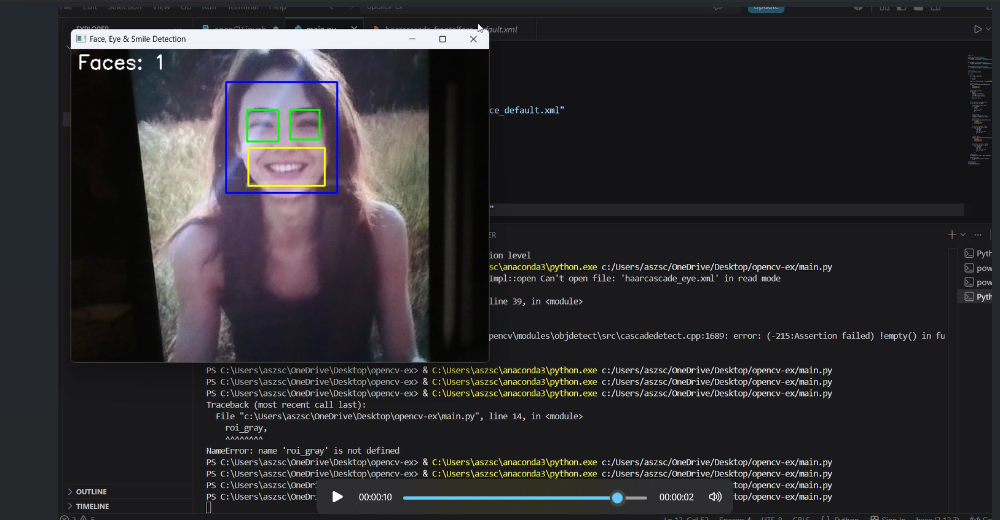

# 😊 Real-Time Face, Eye & Smile Detection using OpenCV

## 📌 Overview

This project is a real-time computer vision application developed using **Python** and **OpenCV**. It detects faces, eyes, and smiles from a webcam using Haar Cascade Classifiers.

---

## ✨ Features

- 👤 Real-time Face Detection
- 👀 Eye Detection
- 😊 Smile Detection
- 🎥 Live Webcam Processing
- 📊 Face Counter Display
- ⚡ Fast and Lightweight using OpenCV

---

## 🛠 Technologies Used

- Python
- OpenCV
- Haar Cascade Classifiers

---

## 🚀 How to Run

1. Clone the repository

```bash
git clone https://github.com/layalxworks/opencv-face-eye-smile-detection.git
```

2. Install the required packages

```bash
pip install -r requirements.txt
```

3. Run the project

```bash
python main.py
```

---

## 🎥 Demo Video

[]([https://youtu.be/PUT_YOUR_VIDEO_LINK_HERE](https://youtu.be/7944lCqnluk?si=H8k8gfMdHc7z8BbF])]
---

## 📂 Project Structure

```
opencv-face-eye-smile-detection/
│
├── main.py
├── README.md
├── requirements.txt
├── result.png
└── demo.mp4
```

---

## 👩‍💻 Author

**Layal Aljohani**

AI Student | Computer Vision Enthusiast
